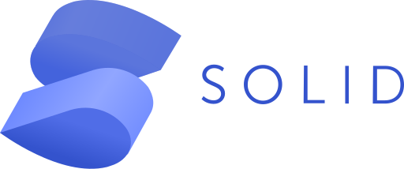
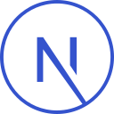
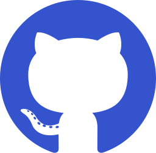
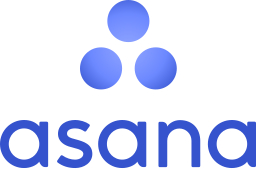
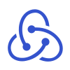
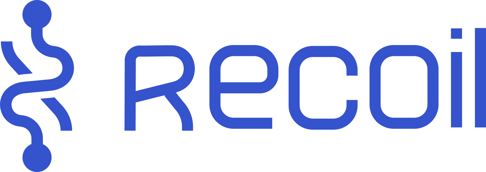
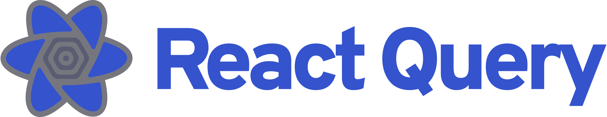
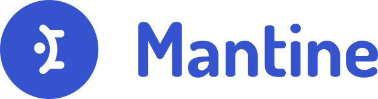
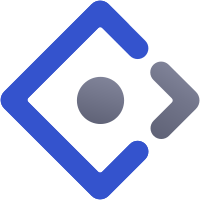
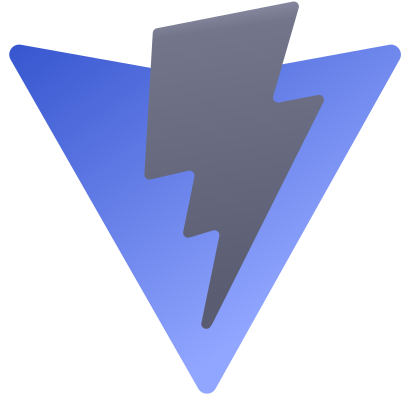

<h1> Hi, I’m Duong Tien Vinh</h1>

## 🥷 ABOUT ME:

<table>
    <tr>
        <td>
            
 I am a third-year undergraduate student at VNUHCM-University of Science, majoring in Computer Networks & Cybersecurity.

            
 I am currently learning React ⚛️ for Front-End Development.

            
 Kinda self-motivated learner.

            
 Eager for new web technologies, frameworks, libraries.

            
 Hobby: sleep, read tech blogs, listen to music.

        </td>
        <td>
            
        </td>
    </tr>
</table>

---

## 🤖 TECHNOLOGIES:

<table>
    <tr>
        <td></td>
        <td>Learning</td>
        <td>Interested</td>
    </tr>
    <tr>
        <td>Framework</td>
        <td>
            
        </td>
        <td>
            
            
        </td>
    </tr>
    <tr>
        <td>Languages</td>
        <td>
            
            
            
            
            
        </td>
        <td>
            
            
        </td>
    </tr>
    <tr>
        <td>Database</td>
        <td>
            
        </td>
        <td>
        </td>
    </tr>
    <tr>
        <td>CI/CD</td>
        <td>
            
            
        </td>
        <td>
            
        </td>
    </tr>
    <tr>
        <td>Source Code Management (SCM)</td>
        <td>
            
            
        </td>
        <td>
        </td>
    </tr>
    <tr>
        <td>Lint Tools, Formatters</td>
        <td>
            
            
        </td>
        <td>
        </td>
    </tr>
    <tr>
        <td>Text Editor</td>
        <td>
            
        </td>
        <td>
        </td>
    </tr>
    <tr>
        <td>Design Tools</td>
        <td>
            
        </td>
        <td>
            
        </td>
    </tr>
    <tr>
        <td>Team Collaboration Tools</td>
        <td>
            
            
            
        </td>
        <td>
            
        </td>
    </tr>
</table>

---

## ⚙️ FRONT END STACK:

<table>
    <tr>
        <td></td>
        <td>Learning</td>
        <td>Interested</td>
    </tr>
    <tr>
        <td>Framework</td>
        <td>
            
            
<a href="https://reactjs.org/">React</a>

        </td>
        <td>
            
            
<a href="https://www.solidjs.com/">SolidJS</a>

            
            
<a href="https://nextjs.org/">NextJS</a>

        </td>
    </tr>
    <tr>
        <td>State Management</td>
        <td>
            
            
<a href="https://redux-toolkit.js.org/">Redux Toolkit</a>

        </td>
        <td>
            
            
<a href="https://recoiljs.org/">Recoil</a>

        </td>
    </tr>
    <tr>
        <td>Data Fetching</td>
        <td>
            
            
<a href="https://react-query.tanstack.com/">Redux Query</a>

        </td>
        <td>
        </td>
    </tr>
    <tr>
        <td>Component Styling</td>
        <td>
            
            
<a href="https://windicss.org/">WindiCSS</a>

        </td>
        <td>
            
            
<a href="https://vanilla-extract.style/">Vanilla Extract</a>

        </td>
    </tr>
    <tr>
        <td>UI Component Library</td>
        <td>
            
            
<a href="https://mantine.dev/">Mantine</a>

        </td>
        <td>
            
            
<a href="https://ant.design/">Ant Design</a>

            
            
<a href="https://chakra-ui.com/">Chakra UI</a>

        </td>
    </tr>
    <tr>
        <td>Build Tool</td>
        <td>
            
            
<a href="https://vitejs.dev/">Vite</a>

        </td>
        <td>
        </td>
    </tr>
</table>

---

## 🤙 CONTACT ME:

✉️: tienvinh.duong4@gmail.com

---

## 🙌 CONTRIBUTION GRAPH:

---

## 📈 GITHUB STATS:

    
    

