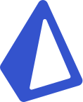

# Hi, I’m Duong Tien Vinh

[](mailto:tienvinh.duong4@gmail.com)
&nbsp;
[](https://gitlab.com/DuckyMomo20012)
&nbsp;
[](https://www.linkedin.com/in/duong-tien-vinh)
&nbsp;
[](https://twitter.com/duckymomo20012)
&nbsp;
[](https://t.me/duckymomo20012)
&nbsp;
[](https://join.skype.com/invite/xabx5AI61PJc)
&nbsp;
[](https://discordapp.com/users/509778560224067605/)

> 🔮: Toggle to 🌙/☀️ mode to see image change.

## 🦄 ABOUT ME:

<table>
    <tr>
        <td>
            <li>
                I am a third-year undergraduate student at <b>VNUHCM-University of Science</b>, majoring in <b>Computer Networks & Cybersecurity</b>.
            </li>
            <li>
                I am currently learning <code>React ⚛️</code> for Front-End Development.
            </li>
            <li>
                Kinda self-motivated learner.
            </li>
            <li>
                Eager for new web technologies, frameworks, libraries.
            </li>
            <li>
                Hobby: sleep, read tech blogs, listen to music.
            </li>
        </td>
        <td>
            
        </td>
    </tr>
</table>

---

## 🖥️ CODING ACTIVITY:

<!--START_SECTION:waka-->
**I'm a Night 🦉** 

```text
🌞 Morning    90 commits     █████░░░░░░░░░░░░░░░░░░░░   22.73% 
🌆 Daytime    73 commits     ████░░░░░░░░░░░░░░░░░░░░░   18.43% 
🌃 Evening    213 commits    █████████████░░░░░░░░░░░░   53.79% 
🌙 Night      20 commits     █░░░░░░░░░░░░░░░░░░░░░░░░   5.05%

```


📊 **This Week I Spent My Time On** 

```text
⌚︎ Time Zone: Asia/Ho_Chi_Minh

💬 Programming Languages: 
JavaScript               25 hrs 32 mins      ██████████████████░░░░░░░   72.19% 
SQL                      2 hrs 41 mins       ██░░░░░░░░░░░░░░░░░░░░░░░   7.59% 
Python                   2 hrs 24 mins       █░░░░░░░░░░░░░░░░░░░░░░░░   6.79% 
Other                    2 hrs 1 min         █░░░░░░░░░░░░░░░░░░░░░░░░   5.75% 
Markdown                 1 hr 16 mins        █░░░░░░░░░░░░░░░░░░░░░░░░   3.62%

🐱‍💻 Projects: 
student-dashboard-nextjs 21 hrs 31 mins      ███████████████░░░░░░░░░░   60.83% 
Unknown Project          5 hrs 5 mins        ███░░░░░░░░░░░░░░░░░░░░░░   14.38% 
login-form-nextjs        4 hrs 13 mins       ███░░░░░░░░░░░░░░░░░░░░░░   11.96% 
nextjs-template          1 hr 37 mins        █░░░░░░░░░░░░░░░░░░░░░░░░   4.61% 
nodejs-yolov5            1 hr 6 mins         ░░░░░░░░░░░░░░░░░░░░░░░░░   3.15%

```


 Last Updated on 24/04/2022 04:41:07 UTC
<!--END_SECTION:waka-->

---

## 🤖 TECHNOLOGIES:

<table>
    <tr>
        <th></th>
        <th>Learning</th>
        <th>Interested</th>
    </tr>
    <tr>
        <td>Framework</td>
        <td>
            
            &nbsp;
            
            
            &nbsp;
        </td>
        <td>
            
            
            &nbsp;
        </td>
    </tr>
    <tr>
        <td>Languages</td>
        <td>
            
            &nbsp;
            
            &nbsp;
            
            &nbsp;
            
            &nbsp;
        </td>
        <td>
            
            &nbsp;
            
            &nbsp;
        </td>
    </tr>
    <tr>
        <td>Database</td>
        <td>
            
            &nbsp;
            
            
            &nbsp;
            
            &nbsp;
        </td>
        <td>
        </td>
    </tr>
    <tr>
        <td>CI/CD</td>
        <td>
            
            &nbsp;
            
            &nbsp;
        </td>
        <td>
            
            &nbsp;
        </td>
    </tr>
    <tr>
        <td>Source Code Management (SCM)</td>
        <td>
            
            &nbsp;
            
            
            &nbsp;
        </td>
        <td>
        </td>
    </tr>
    <tr>
        <td>Lint Tools, Formatters</td>
        <td>
            
            &nbsp;
            
            
            &nbsp;
        </td>
        <td>
        </td>
    </tr>
    <tr>
        <td>Text Editor</td>
        <td>
            
            &nbsp;
        </td>
        <td>
        </td>
    </tr>
    <tr>
        <td>Design Tools</td>
        <td>
            
            &nbsp;
        </td>
        <td>
            
            &nbsp;
        </td>
    </tr>
    <tr>
        <td>Team Collaboration Tools</td>
        <td>
            
            &nbsp;
            
            &nbsp;
            
            &nbsp;
        </td>
        <td>
            
            
            &nbsp;
        </td>
    </tr>
</table>

---

## ⚙️ FRONT END STACK:

<table>
    <tr>
        <th></th>
        <th><div align="center">Learning</div></th>
        <th><div align="center">Interested</div></th>
    </tr>
    <tr>
        <td>Framework</td>
        <td align="center">
            
            <p align="center"><code><a href="https://reactjs.org/">React</a></code></p>
            
            
            <p align="center"><code><a href="https://nextjs.org/">NextJS</a></code></p>
        </td>
        <td align="center">
            
            
            <p align="center"><code><a href="https://www.solidjs.com/">SolidJS</a></code></p>
        </td>
    </tr>
    <tr>
        <td>Routing</td>
        <td align="center">
            
            <p align="center"><code><a href="https://reactrouter.com/docs/en/v6">React Router v6</a></code></p>
        </td>
        <td align="center">
            
            
            <p align="center"><code><a href="https://react-location.tanstack.com/">React Location</a></code></p>
        </td>
    </tr>
    <tr>
        <td>State Management</td>
        <td align="center">
            
            <p align="center"><code><a href="https://redux-toolkit.js.org/">Redux Toolkit</a></code></p>
        </td>
        <td align="center">
            
            
            <p align="center"><code><a href="https://recoiljs.org/">Recoil</a></code></p>
        </td>
    </tr>
    <tr>
        <td>Data Fetching</td>
        <td align="center">
            
            
            <p align="center"><code><a href="https://react-query.tanstack.com/">React Query</a></code></p>
        </td>
        <td align="center">
        </td>
    </tr>
    <tr>
        <td>Component Styling</td>
        <td align="center">
            
            <p align="center"><code><a href="https://windicss.org/">WindiCSS</a></code></p>
        </td>
        <td align="center">
            
            <p align="center"><code><a href="https://vanilla-extract.style/">Vanilla Extract</a></code></p>
        </td>
    </tr>
    <tr>
        <td>UI Component Library</td>
        <td align="center">
            
            
            <p align="center"><code><a href="https://mantine.dev/">Mantine</a></code></p>
        </td>
        <td align="center">
            
            <p align="center"><code><a href="https://ant.design/">Ant Design</a></code></p>
            
            
            <p align="center"><code><a href="https://chakra-ui.com/">Chakra UI</a></code></p>
        </td>
    </tr>
    <tr>
        <td>Build Tool</td>
        <td align="center">
            
            <p align="center"><code><a href="https://vitejs.dev/">Vite</a></code></p>
        </td>
        <td align="center">
        </td>
    </tr>
</table>

---

## ☎️ CONTACT ME:

<p>📫: tienvinh.duong4@gmail.com (Primary)</p>
<p>📫: tienvinh.duong2@gmail.com (Secondary)</p>
<a href="mailto:tienvinh.duong4@gmail.com"></a>
&nbsp;
<a href="https://www.linkedin.com/in/duong-tien-vinh"></a>
&nbsp;
<a href="https://twitter.com/duckymomo20012"></a>
&nbsp;
<a href="https://t.me/duckymomo20012"></a>
&nbsp;
<a href="https://join.skype.com/invite/xabx5AI61PJc"></a>
&nbsp;
<a href="https://discordapp.com/users/509778560224067605/"></a>

---

## 📈 CONTRIBUTION GRAPH:

<!-- Light Mode:
- bg_color= #504945
- color= #D4BE98
- line= #7DA3A3
- point= #EA6962

Dark Mode:
- bg_color= #46464E
- color= #E4E1E6
- line= #B9C3FF
- point= #E5BAD7 -->


---

## 🏆 GITHUB STATS:

<!-- Light Mode:
- title_color= #D4BE98
- text_color= #7DA3A3
- icon_color= #EA6962
- bg_color= #504945

Dark Mode:
- title_color= #B9C3FF
- text_color= #C6C5CF
- icon_color= #E5BAD7
- bg_color= #46464E

Top Languages config:
- layout=compact
- langs_count=10 -->

<p align="center">
    
    &nbsp;
    
</p>
